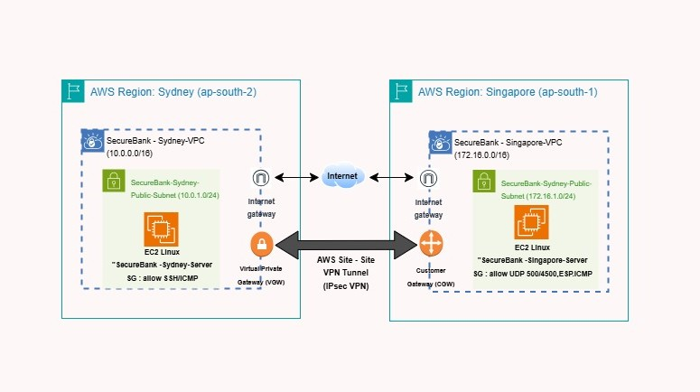

# SecureBank Multi-Region AWS Network Isolation Framework

An enterprise-grade, multi-region network infrastructure blueprint designed for a simulated financial services institution (**SecureBank**). This architecture implements strict Virtual Private Cloud (VPC) network isolation, multi-tier segmentation, and secure inter-region cryptographic routing via an encrypted IPsec Site-to-Site VPN tunnel mapping regional operational nodes.

## 📄 Executive Technical Documentation
👉 [**Click here to read the full Systems Security Engineering PDF**](documents/aws-secure-vpn-project.pdf)

---

## 🏗️ Architectural Topology Diagram

*Figure 1: Cross-regional schematic demonstrating zero-trust network topology spanning Sydney and Singapore AWS data boundaries, interconnected through a hardware-virtualized IPsec tunnel configuration.*

---

## ⚙️ Technical Breakdown & Tier Security

### 1. Cross-Regional Network Topologies
The infrastructure maintains distinct regional isolation protocols to minimize organizational blast radiuses:
*   **🇦🇺 Primary Node (Sydney Data Boundary):** Houses the `SecureBank-Sydney-VPC` (CIDR `10.0.0.0/16`) hosting localized administrative infrastructure and a target **Virtual Private Gateway (VGW)** acting as the secure multi-region landing anchor.
*   **🇸🇬 Distributed Node (Singapore Data Boundary):** Houses the `SecureBank-Singapore-VPC` (CIDR `172.16.0.0/16`) acting as a secure operations tier, utilizing a software-defined **Customer Gateway (CGW)** bound to a static Elastic IP address.

### 2. Cryptographic Routing & Inter-VPC Tunneling
*   **Hardware VPN Tunneling:** Implements an enterprise AWS Site-to-Site VPN framework passing secure transit metrics over public web paths via advanced encryption parameters: **IKEv2**, **AES-256 bit encryption blocks**, and **SHA-256 hashing integrity verification**.
*   **Linux Security Engineering:** Deployed and hardened native Linux workloads utilizing the Open Source **Libreswan IPsec** stack. Configured low-level configuration matrices (`ipsec.conf` and `aws-vpn.secrets`) to achieve robust, high-performance private IP routing across the multi-region transport tier.

### 3. Stateful Perimeter Firewalls & Least-Privilege Guardrails
*   **Default-Deny Access Matrices:** Fine-tuned AWS Security Groups utilizing restrictive, stateful ingress policy boundaries. Administrative shell access (SSH) and network echo requests (ICMP) are pinned exclusively to trusted origin ranges, eliminating public network vectors.
*   **Deterministic Routing Tables:** Custom Route Tables steer data paths explicitly. Internal subnet packets targeted for corresponding cross-region workloads are dynamically forced down the cryptographic Virtual Private Gateway tunnel boundary.

---

## 🛠️ Technology Stack & Security Blueprints Verified
*   **Cloud Networks:** AWS VPC (Multi-Region Topology), Public/Private Subnetting, Advanced CIDR Optimization
*   **Cryptographic Mesh:** AWS Virtual Private Gateways (VGW), Customer Gateways (CGW), Site-to-Site IPsec VPN
*   **Compute Hardening:** Linux Cloud Environments, Libreswan IPsec Systems, Kernel Network Primitives
*   **Encryption Parameters:** AES-256 standard, IKEv2 Protocols, SHA-256 Data Verification Streams
*   **Security Frameworks Applied:** NIST Cyber Security Framework, AWS Security Pillar, Zero-Trust Architecture, Defense-in-Depth Control Mechanisms
